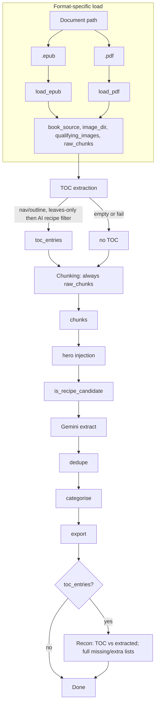
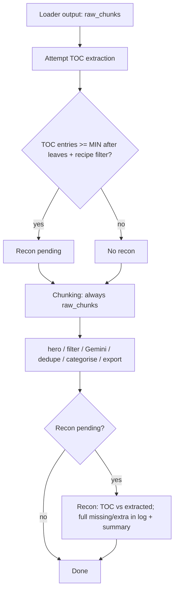
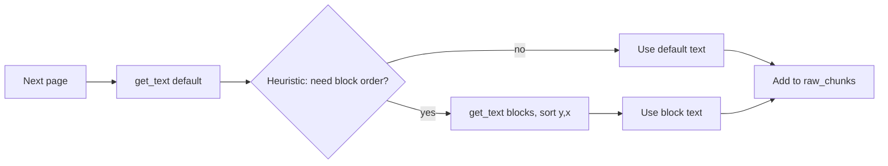

# Document Loader Design

This document describes how RecipeParser loads cookbooks from different document formats and processes them through a unified pipeline. **EPUB** and **PDF** are supported; the design allows additional document types to be added later. Each loader produces the same output shape, so all downstream steps (TOC extraction, chunking, extraction, categorisation, export) are format-agnostic.

---

## 1. Goals

- **Unified pipeline**: A single document-processing pipeline consumes output from any loader. Format-specific logic is confined to the loader.
- **Single entry point**: User selects one file (EPUB or PDF); the app chooses the loader by extension. No format selector in the UI.
- **Loader contract**: Every loader returns `(book_source, image_dir, qualifying_images, raw_chunks)`. Chunking is always the loader's `raw_chunks` (no TOC-driven segmentation in the current implementation).
- **TOC reconciliation**: When a document has a table of contents, use it to derive a recipe list and reconcile extracted recipes (report counts, missing, extra). TOC is used for recon only.
- **Extensibility**: New document types (e.g. DOCX, HTML) can be added by implementing a loader that satisfies the contract.

---

## 2. Overall Pipeline (Generic Document Processing)

After a loader runs, the pipeline is identical for all document types.

### 2.1 Pipeline flow


```
[EPUB file] → read_epub → get_book_source, extract_all_images, extract_chapters_with_image_markers
    → (book_source, image_dir, qualifying_images, raw_chunks)
    → split_large_chunk → hero injection → is_recipe_candidate → Gemini extract → dedupe → categorise → export
```

Only the first line is EPUB-specific. The rest consumes a single data shape.

The loader is the only format-specific component. TOC sources differ by format (see §3 and §4); extraction, recipe filter, and recon logic are shared.

### 2.2 Loader contract

Every loader has the same signature and return type:

- **Input**: `(path: str, output_dir: str)`
- **Output**: `tuple[str, str, set[str], list[str]]`
  - `book_source`: e.g. "Title — Author" for export metadata
  - `image_dir`: path to the directory where images were written
  - `qualifying_images`: set of image filenames that meet size/quality bar
  - `raw_chunks`: ordered list of text strings (with optional `[IMAGE: ...]` markers). These are the chunk units for extraction.

Pipeline dispatches by extension (`.epub` → `load_epub`, `.pdf` → `load_pdf`).

### 2.3 Data flow diagram → load_epub(path, output_dir)  OR  load_pdf(path, output_dir)
    → (book_source, image_dir, qualifying_images, raw_chunks)   [unchanged contract]

    → TOC extraction (EPUB nav/NCX or PDF outline; fallback: AI parse of first chunks/pages)
        → EPUB: flatten to leaf entries only (fallback: all levels if too few leaves)
        → AI: filter to recipe-only entries (exclude Cover, Introduction, section headers)
        → toc_entries: list[(title, page_or_section?)]  [used only for recon]

    → Chunking: always raw_chunks (EPUB: split by document; PDF: by page)
        → split_large_chunk → hero injection → is_recipe_candidate → Gemini extract → dedupe → categorise → export

    → Recon (when toc_entries non-empty): compare TOC vs extracted recipe names
        → log + run summary: TOC count, extracted, matched, missing list, extra list
```

TOC extraction and the **recipe-only filter** run before chunking; the resulting `toc_entries` are used **only for recon** after extraction. Chunking is always the loader’s raw chunks (no TOC-driven segmentation in the current implementation).

### 2.3 Data flow diagram



---

## 3. EPUB Loader

### 3.1 Overview

The EPUB loader extracts text and images from an EPUB file and produces chunks per **document** (chapter/entry). EPUB has a well-defined structure (OPF spine, nav/NCX), so chunking follows the document order.

### 3.2 Implementation

- Implementation: `load_epub(epub_path, output_dir)` → `read_epub` → `get_book_source` → `extract_all_images` → `extract_chapters_with_image_markers` → return the four-tuple.
- **raw_chunks**: One entry per document in spine order. Each chunk is the concatenated XHTML content with `[IMAGE: filename]` markers for qualifying images.
- **Exception**: `EpubExtractionError` on open/parse failure.

### 3.3 TOC (EPUB)

- **Source**: Machine-readable **nav** (HTML) or **NCX**. Both expose a hierarchical TOC.
- **Extraction**: Flatten to **leaf entries only** (bottom-level items; section/chapter nodes like "Part One" are excluded). If the leaf count is below **MIN_TOC_ENTRIES**, fall back to flattening **all levels**. If nav/NCX is missing or empty, use AI on the first 2 documents to parse a TOC.
- **Recipe filter**: Same as for all formats (see §6).

---

## 4. PDF Loader

### 4.1 Overview

The PDF loader extracts text and images page by page. PDFs lack EPUB's structural guarantees; layout (columns, tables) can affect text order. Pre-flight checks decide whether the PDF is suitable for parsing.

### 4.2 Implementation

  - Open PDF; read metadata (title/author) for `book_source`; fallback to filename or "PDF Auto-Import".
  - Extract images: iterate pages, get images via PyMuPDF, write to `output_dir/images/` with stable names (e.g. `page{N}_img{M}.png`). Filter by `MIN_PHOTO_BYTES`; build `qualifying_images` set.
  - Build `raw_chunks`: one entry per page (or merge very small pages). For each page, get text (see §4.4); prepend or append `[IMAGE: filename]` for each qualifying image on that page. Optionally use block-based extraction and sort by (y, x) if default text order is bad (see §7.3).
- **Exception**: `PdfExtractionError` (or shared `BookExtractionError`) on open/parse failure.

### 4.3 Pre-flight assessment

Before running the full PDF loader, run a **pre-flight pass** to decide whether the PDF is a reasonable candidate for parsing. This avoids wasting API calls and user time on PDFs that are scans, non-cookbooks, or otherwise unlikely to yield good results. Pre-flight runs once per PDF, immediately after the user selects the file (or at the start of `load_pdf`); on failure or “poor candidate”, we can abort with a clear message or warn and continue.

#### 4.3.1 Criteria

| Criterion | Purpose | Suggested approach |
|-----------|---------|--------------------|
| **Has extractable text** | Reject image-only/scanned PDFs (no text layer). | **Programmatic**: PyMuPDF — count text blocks or total character count across first N pages (e.g. 5). If below threshold (e.g. &lt; 100 chars per page on average), treat as no text layer. |
| **Page count in range** | Reject empty or suspiciously tiny files; optionally cap very large files. | **Programmatic**: `doc.page_count`. Reject if 0; warn if &lt; 3 (might be a pamphlet); optional hard cap (e.g. 2000) to avoid runaway cost. |
| **Not password-protected** | Cannot parse locked PDFs. | **Programmatic**: PyMuPDF — try to access first page or metadata; if access denied, fail fast with “PDF is password-protected”. |
| **Language / script** | Optional: prefer supporting primary language (e.g. English) so prompts and heuristics align. | **Hybrid**: Programmatic — sample first page text, run a simple script-detection or language-guess (e.g. character set). If clearly non-Latin and we don’t support it, warn or abort. Optional AI: “What language is this text?” for borderline. |
| **Likely a cookbook / recipe content** | Reduce false positives (e.g. novels, manuals). | **Hybrid**: Programmatic — run existing `is_recipe_candidate()` on first 2–3 pages’ text; if no page passes, flag. Then **AI**: “Based on this sample (first 1–2 pages), is this document a cookbook or recipe collection? Answer yes/no and brief reason.” Only run AI when programmatic is ambiguous (e.g. one page passes, or metadata says “cookbook”). |

#### 4.3.2 Decision outcome

- **Pass**: Proceed to `load_pdf` and the rest of the pipeline.
- **Hard fail**: e.g. no text layer, password-protected, 0 pages. Abort with a specific error (no API calls).
- **Warn and continue**: e.g. “PDF may not be a cookbook” or “very few pages” — log warning and proceed so the user can still try.
- **Soft fail (configurable)**: e.g. “AI says not a cookbook” — abort unless user has opted in (e.g. “Parse anyway” in GUI or `--force` in CLI).

#### 4.3.3 Where it runs

- **Option A**: At the very start of `load_pdf(path, output_dir)`: open doc, run programmatic checks, optionally run AI assessment on a small sample, then either return the four-tuple or raise `PdfExtractionError` / `PdfNotSuitableError` with a clear reason.
- **Option B**: Separate entry point `assess_pdf(path) -> PreFlightResult` called by the pipeline (or GUI) before calling `load_pdf`; pipeline only calls `load_pdf` if assessment passes or user overrides. Keeps pre-flight logic out of the loader and allows GUI to show “This PDF may not be suitable…” before starting.

Recommendation: **Option A** (inside `load_pdf`) for simplicity; first line of `load_pdf` opens the doc and runs programmatic checks; if “likely not cookbook” is desired, a single AI call on first 1–2 pages’ text can be the last step before proceeding to image/text extraction.

---

### 4.4 Chunking and layout

- One chunk per page. Text from `page.get_text()`. Images get `[IMAGE: filename]` markers. Long pages split with `split_large_chunk()`. PDFs have no DOM; optional block-based extraction (sort by y,x) for complex layouts.

### 4.5 TOC (PDF)


- **Source**: Outline/bookmarks (`doc.get_toc()`); often includes page numbers.
- **Fallback**: If outline is missing or too shallow, send first **TOC_PDF_FRONT_MATTER_PAGES** to AI.
- **Recipe filter**: Same as EPUB (see §6).

---

## 5. Format comparison

| Aspect | EPUB | PDF |
|--------|------|-----|
| Chunk unit | Per document (chapter) | Per page |
| TOC source | Nav/NCX (leaf-only) | Outline/bookmarks |
| Page numbers | Usually no | Often in outline |
| Pre-flight | None | Text layer, page count, password |
| Block-based text | N/A (DOM) | Optional (sort by y,x) |

---

## 6. TOC extraction and reconciliation (shared)

Recipe-only filter, recon logic, and constants apply to both formats. See §7.2–7.4 for extraction/fallback and §7.4 for recon.

---

## 7. Parsing strategy and fallback decisioning

This section defines **when** we take each path (TOC vs raw chunking, block-based vs default PDF text) and **on what basis** we fall back. All decisions are deterministic and threshold-based where possible; no FSM.

### 7.1 Overview

- **TOC extraction** is attempted for both EPUB and PDF. The result is used **only for recon** (comparison vs extracted recipe names). **Chunking is always raw** (loader’s `raw_chunks` as-is); TOC-driven segmentation is not used in the current implementation.
- **PDF text order**: We may use **block-based** extraction (sort by position) instead of default `get_text()` when a heuristic suggests layout problems (see 7.3).
- **Recon** runs when we have a non-empty `toc_entries` list (see 7.4).

### 7.2 TOC extraction: attempt and fallback basis

**When we attempt TOC extraction**

- **EPUB**: Always attempt. Parse nav/NCX; flatten to **leaf entries only** (bottom-level TOC items only, so section/chapter headers like "Part One" are excluded). If the leaf count is below **MIN_TOC_ENTRIES**, fall back to flattening **all levels**. If nav is missing or empty, use AI on the first 1–2 documents to parse a TOC.
- **PDF**: Always attempt. Use outline/bookmarks (`doc.get_toc()`); if missing or too shallow, extract text from first N pages and send to AI to list recipe titles and page numbers.

**Recipe-only filter (always applied)**

- After obtaining a raw TOC (programmatic or AI-parsed), we **always** run one AI classification call (`filter_toc_to_recipe_entries`) to keep only entries that are recipe/dish names and drop section headers and front matter (e.g. Cover, Introduction, "How to Make Dough"). The pipeline uses only this filtered list for recon. On classification failure we keep the full list so recon still runs.

**When we consider TOC "successful" (and keep it for recon)**

- We have at least **MIN_TOC_ENTRIES** entries (after leaf-only flatten for EPUB, after recipe filter for both). Fewer than that and we do not run recon (recon_status = SKIPPED).

**When we have no TOC for recon**

- No nav/outline and AI returned empty or fewer than **MIN_TOC_ENTRIES**.
- AI parsing or recipe-filter call failed and returned empty.

**Basis summary**

| Condition | Decision |
|-----------|----------|
| TOC entries >= MIN_TOC_ENTRIES after extraction + recipe filter | Use TOC for recon only; chunking remains raw. |
| TOC empty / failed / below threshold | No recon; chunking remains raw. |

### 7.3 PDF text extraction: default vs block-based

**When we use default `get_text()`**

- Default for all PDFs unless the heuristic below triggers.

**When we use block-based extraction (sort by y, then x)**

- **Heuristic**: For each of the first **N_SAMPLE_PAGES** (e.g. 5), get text with default `get_text()` and with block-based (dict/blocks, sort by (y0, x0), concatenate). Compare character count or line count. If block-based yields **meaningfully more** text (e.g. > 20% more) or **fewer** very-short lines, treat as "likely multi-column or complex layout" and use block-based for the **entire** document.
- **Alternative (simpler)**: Use block-based unconditionally for PDF (slightly slower but more predictable). Then no heuristic needed; we rely on "block order is usually better" for cookbooks.
- **Basis**: Programmatic only (no AI). Thresholds: N_SAMPLE_PAGES, percent difference in length or line count. If we adopt "always block-based for PDF", this decision goes away.

**Recommendation**: Start with **default only**; add block-based as a fallback when we detect "very little text per page" (e.g. < 200 chars on first 3 pages) to handle "text is there but in wrong order". Later, optional "always use block order for PDF" config.

### 7.4 Recon: when it runs

- Recon runs when `toc_entries` is non-empty and we have at least **MIN_TOC_ENTRIES** (so recon_status was set to PENDING at TOC extraction). We compare the recipe-only TOC list to extracted recipe names and log counts plus the full **missing** (in TOC but not extracted) and **extra** (extracted but not in TOC) lists. The same lists are included in the **run summary** at the end of the pipeline.

### 7.5 Segment-by-TOC (implemented, not used in pipeline)

- **Status**: The function `segment_by_toc()` exists in `toc.py` and can segment full text by TOC entry boundaries (find start of each title in order, split by `MAX_CHUNK_CHARS`). The pipeline **does not use it**; chunking is always raw. This section documents the behaviour for possible future use (e.g. optional TOC-driven chunking).
- **Input**: Full text (concatenated `raw_chunks` with a delimiter) and `toc_entries`.
- **Algorithm**: For each TOC title in order, search for the first occurrence (normalized: lowercase, collapse spaces) in the full text after the previous segment start. Segment = text from this start to the next start (or end). If a segment exceeds **MAX_CHUNK_CHARS**, split with `split_large_chunk`. **MIN_TOC_MATCH_RATIO** would apply if we used this path (e.g. fall back to raw if fewer than 30% of titles are found).

### 7.6 Decision flow summary



For PDF only, before building `raw_chunks`:



### 7.7 Configurable constants

| Constant | Value | Purpose |
|----------|-------|---------|
| MIN_TOC_ENTRIES | 2 | Fewer = no recon (TOC not used). |
| MIN_TOC_RECIPE_RATIO | 0.5 | Used by `check_recipe_name_ratio()`; not used for pipeline fallback (we always filter to recipe-only). |
| MIN_TOC_MATCH_RATIO | 0.3 | Used only if TOC-driven chunking is enabled in future (segment_by_toc). |
| TOC_PDF_FRONT_MATTER_PAGES | 10 | Pages to send to AI when PDF outline is missing or shallow. |
| PDF_PREFLIGHT_MIN_CHARS_PER_PAGE | 100 | Below this (average over first N pages) = no text layer / scan. |

### 7.8 FSM reconsidered

We now have several decision points: PDF pre-flight (pass / fail / warn), TOC extraction (attempt → success vs fallback), recipe-name ratio, segment-match ratio, chunking path (TOC vs raw), and whether to run recon. The question is whether to model this as an **explicit FSM** (state enum + transition table) instead of a linear sequence of conditionals.

**Conclusion: still not required, but a *stage* enum is recommended for clarity and logging.**

- **Flow remains acyclic**: We never loop back (e.g. "retry TOC" or "go back to load"). We only branch forward: try TOC → use it or fall back to raw; then extract → recon if TOC was used. There are no event-driven transitions (user pause/resume, retries). So the control flow is "structured if/else over stages," not "react to events and transition between states."
- **An FSM becomes useful when**: (1) We add **retries** (e.g. on failure transition back to Load or TOCAttempt). (2) We add **pause/resume** or user-driven transitions. (3) The number of states and transitions grows enough that a transition table is easier to maintain than nested conditionals. (4) We want **audit logging** where every transition is explicit ("entered state X because Y").
- **Recommendation**:
  - **Now**: Keep the pipeline as a **linear sequence of steps** with clear conditionals (as in §7.2–7.5). **Maintain a state enum class** that reflects all relevant state variables (stage, chunking path, recon status, pre-flight outcome); see §7.9. Set it at each step; use for logging and GUI progress. No transition table—just assign the state as we go.
  - **Later**: If we add retries, pause/resume, or many more branches, introduce a real FSM (state enum + `transition(event)` or explicit next-state table) so the allowed paths are first-class and easy to reason about.

### 7.9 State enum class (required)

Despite the pipeline being acyclic, we **explicitly maintain a state enum class** that reflects the current state variables at each step. This makes the pipeline auditable, loggable, and testable without introducing a full FSM.

**State variables to capture**

- **Stage**: Where we are in the pipeline. Enum values should align with the steps in §7.6 (e.g. `LOAD`, `PREFLIGHT`, `TOC_EXTRACT`, `CHUNK`, `EXTRACT`, `RECON`, `EXPORT`). Sub-stages are acceptable (e.g. `CHUNK_TOC` vs `CHUNK_RAW`) so logs and GUI can show "Chunking (TOC)" vs "Chunking (raw)".
- **Chunking path** (when past TOC): Whether we are using TOC-driven segments or raw chunks. Enum or flag: e.g. `TOC_DRIVEN` | `RAW_CHUNKS`.
- **Recon**: Whether recon will run / has run. Enum or flag: e.g. `RECON_PENDING`, `RECON_DONE`, `RECON_SKIPPED` (no TOC used).
- **Pre-flight outcome** (PDF only): e.g. `PREFLIGHT_PASS`, `PREFLIGHT_FAIL`, `PREFLIGHT_WARN`.

**Form**

- A single **state enum class** (or small set of enums) in one place (e.g. `recipeparser/pipeline.py` or `recipeparser/state.py`) that defines these values. The pipeline (and any GUI/CLI that reports progress) **updates this state** at each relevant step—e.g. set `stage = Stage.CHUNK`, `chunking_path = ChunkingPath.TOC_DRIVEN`—so that at any moment the state enum class reflects the current state variables.
- **No transition table**: we do not enforce "only X can follow Y"; we only **set** the state as we go. The enum class is the single source of truth for "what state are we in?" for logging, progress, and debugging.

**Usage**

- Logging: log the current stage (and path/recon when relevant) at step boundaries.
- GUI: progress label or status text derived from the state enum (e.g. "TOC extraction", "Chunking (TOC)", "Recon…").
- Tests: assert on state after a step (e.g. after TOC fallback, `chunking_path == ChunkingPath.RAW_CHUNKS`).

**Example (conceptual)**

```text
class Stage(Enum): LOAD; PREFLIGHT; TOC_EXTRACT; CHUNK_TOC; CHUNK_RAW; EXTRACT; RECON; EXPORT
class ChunkingPath(Enum): TOC_DRIVEN; RAW_CHUNKS
class ReconStatus(Enum): SKIPPED; PENDING; DONE
# Pipeline holds current_stage, chunking_path (when applicable), recon_status; set at each step.
```

---

## 8. GUI and CLI

- **GUI**: One file input; label e.g. “Cookbook file (EPUB or PDF)”. File dialog: `*.epub;*.pdf`. User picks a file; backend resolves path and chooses loader by extension. No separate “format” control.
- **CLI**: Single positional argument: path to an EPUB or PDF file, or a directory containing exactly one `.epub` or exactly one `.pdf`. Resolve logic extended so that if it’s a directory, look for one `.epub` or one `.pdf` (if both exist, error “specify one file”).
- **API**: `process_epub(book_path, ...)` name can stay for backward compatibility; docstring states it accepts EPUB or PDF.

---

## 9. TOC extraction and use

### 9.1 Purpose

- Get a **recipe list** from the book (TOC or outline) and filter it to **recipe-only** entries via AI.
- **Reconcile** extracted recipes vs that list (report counts, full missing and extra lists in log and run summary). Chunk boundaries are **not** driven by TOC in the current implementation.

### 9.2 Obtaining TOC data

- **EPUB**:
  - Prefer machine-readable **nav/NCX**: parse and get (title, link/section). If that’s sufficient, we may not need AI for structure.
  - If nav is missing or not recipe-level, send **first document(s)** or first N characters to the model with a prompt: “This is the table of contents. Extract the list of recipe titles and, if present, section or document identifiers.”
- **PDF**:
  - Use **outline/bookmarks** (`doc.get_toc()` in PyMuPDF); often includes page numbers.
  - If outline is missing or unhelpful, send **first few pages** to the model: “This is the contents page. List recipe titles and page numbers.”
- **AI**: One Gemini call to normalize and parse: “Given this TOC/outline, return a list of recipe titles and, when available, page numbers or section identifiers.” Output: `list[(title, page_or_section | None)]`. This keeps “spotting” the TOC simple (structure first, AI to parse when needed). Then validate that at least **MIN_TOC_RECIPE_RATIO** of entries look like recipe names (not just section headers), via a second AI call or the same response; if below threshold, do not use TOC (see §7.2).

**Recipe-only filter (implemented)**  
We **always** run one AI classification call on the raw TOC (programmatic nav/outline or AI-parsed fallback) to identify which entries are recipe titles vs section/front matter (e.g. Cover, Introduction, "How to Make Dough"). The pipeline uses only the **filtered** list (recipe entries only) for recon. So recon counts and "missing" lists refer to recipes only, not supporting material. On classification failure we keep the full list so recon still runs.

### 9.3 Chunk separation using TOC

- **Input**: Full ordered text (or `raw_chunks` with a way to map back to positions) and `toc_entries`.
- **Algorithm**: For each TOC entry in order, find the “start” of that recipe in the text (e.g. first occurrence of the title, or start of page N). Segment text from “start of entry i” to “start of entry i+1” (or end of book). Each segment is one recipe’s text; if over `MAX_CHUNK_CHARS`, split with `split_large_chunk`.
- **Fallback**: If TOC extraction fails or returns empty, do not use TOC; use loader’s `raw_chunks` as today (EPUB by document, PDF by page).

### 9.4 Recon

- After extraction we have: `toc_entries` (expected) and `extracted_recipe_names` (from Gemini). The `toc_entries` used here are **recipe-only**: the pipeline runs one AI classification on the raw TOC to drop section headers and front matter (see §7.2), so recon counts and "missing" lists refer only to recipe titles.
- **Matching**: Normalize titles (lowercase, strip punctuation) and match TOC titles to extracted names (exact or fuzzy). Build:
  - `matched`: in both
  - `missing`: in TOC but not in extracted
  - `extra`: extracted but not in TOC (optional to report)
- **Output**: Log and/or GUI: “TOC: 45 recipes; extracted: 42; missing: [Recipe A, Recipe B, Recipe C].” No FSM; a single post-extraction step when `toc_entries` is present.

---

## 10. Implementation phases

| Phase | Content | Status |
|-------|---------|--------|
| **Phase 1** | Loader abstraction; `load_epub`; `load_pdf` with PDF pre-flight; page-based chunks and images. CLI/GUI accept .epub and .pdf. Pipeline dispatches by extension. | **Done** |
| **Phase 2** | TOC extraction (EPUB nav/NCX leaves-only + fallback, PDF outline + AI fallback); **recipe-only AI filter**; recon (TOC vs extracted; full missing/extra in log and run summary). Chunking remains **raw** (no TOC-driven segmentation). | **Done** |
| **Phase 2b** | If needed: block-based PDF text extraction (sort by position) for messy layouts. | Optional |
| **Future** | Optional TOC-driven chunking (use `segment_by_toc` when TOC match ratio is sufficient). | Not implemented |

---

## 11. Files to add or change

Reflects **current** layout. Key modules:

- **recipeparser/epub.py**: `load_epub(path, output_dir)` returning the four-tuple; chapter extraction with image markers.
- **recipeparser/pdf.py**: `load_pdf(path, output_dir)` with pre-flight assessment; page-based chunks and images.
- **recipeparser/pipeline.py**: Dispatches by extension; TOC extraction (EPUB/PDF) → recipe-only filter; **always** raw chunking; recon when TOC present; state enum (Stage, ChunkingPath, ReconStatus); run summary includes full missing/extra lists.
- **recipeparser/toc.py**: EPUB nav parsing (leaf-only flatten, fallback to all levels); PDF outline; AI fallback `_parse_toc_from_text_fallback`; `filter_toc_to_recipe_entries` (recipe-only); `segment_by_toc` (implemented, not used by pipeline); `run_recon`.
- **recipeparser/exceptions.py**: `PdfExtractionError`, etc.
- **recipeparser/__main__.py**, **gui.py**: Accept .epub and .pdf; version from importlib.metadata.
- **recipeparser/__init__.py**: `process_epub(book_path, ...)` accepts EPUB or PDF.
- **config.py**: MIN_TOC_ENTRIES, MIN_TOC_RECIPE_RATIO, MIN_TOC_MATCH_RATIO, TOC_PDF_FRONT_MATTER_PAGES, PDF_PREFLIGHT_*, etc.

---

## 12. Out of scope / future

- **FSM controller**: Re-evaluated in §7.8. Not required for current acyclic, conditional flow; a **stage enum** for logging/progress is recommended. Adopt a full FSM if we add retries, pause/resume, or event-driven transitions.
- Pause/resume or retry states: could be designed later and might then benefit from a state machine.
- Semantic “recipe” detection in PDF (e.g. heading detection) for chunking when TOC is absent: possible follow-up.

---

## 13. Build readiness and best practice

### 13.1 Current implementation

The pipeline is implemented as described above:

- Loaders (`load_epub`, `load_pdf`) follow the contract in §3.1; PDF pre-flight runs inside `load_pdf`.
- TOC extraction: EPUB leaf-only (with all-levels fallback), PDF outline, AI fallback when needed; **recipe-only filter** always applied.
- Chunking is **always raw**; `segment_by_toc` exists but is not used.
- Recon runs when `toc_entries` has at least MIN_TOC_ENTRIES; full missing/extra lists in log and run summary.
- State enum (Stage, ChunkingPath, ReconStatus, PreflightOutcome) is maintained in `pipeline.py`. Constants live in `config.py`.

### 13.2 Best practice checklist

| Criterion | Met? | Notes |
|-----------|------|--------|
| **Clear goals and scope** | Yes | §1 Goals; §10 Out of scope. |
| **Contract-first interfaces** | Yes | Loader contract (§3.1); state enum (§7.9); pipeline input/output. |
| **Single responsibility** | Yes | Loaders = load; toc.py = TOC parse + segment + recon; pipeline = orchestrate. |
| **Explicit fallbacks** | Yes | §7.2–7.5: when and why we fall back; thresholds in §7.7. |
| **Observability** | Yes | State enum for stage, path, recon, pre-flight; logging and GUI progress. |
| **Testability** | Yes | State assertions (§7.9); loader contract testable in isolation; TOC/recon unit tests. |
| **Configurable behaviour** | Yes | Constants table (§7.7); config location to be set in code. |
| **Error handling** | Yes | Pre-flight outcomes (§4.3.2); exceptions named (§3.2, §4.2, §11); hard fail vs warn vs soft fail. |
| **Backward compatibility** | Yes | process_epub name and EPUB behaviour preserved; PDF additive. |
| **Phased delivery** | Yes | Phase 1 (PDF + pre-flight), Phase 2 (TOC + recon), Phase 2b (block-based) in §10. |
| **Documentation** | Yes | Design doc; README update in §11; docstrings for API. |

**Recommendation**: The implementation matches this design. Use this doc as the reference for TOC/recon behaviour and pipeline state.

---

## 14. Summary

- **PDF**: Second loader, same contract as EPUB; page-based chunks (and optionally block-ordered text); images extracted and marked per page.
- **GUI/CLI**: Single file type (EPUB or PDF); backend chooses loader by extension.
- **TOC**: Extract from structure (EPUB nav/NCX **leaf-only** with all-levels fallback, PDF outline, AI fallback); **always** filter to recipe-only via one AI call. Used **only for recon**; chunking is always raw.
- **Recon**: When TOC is present (≥ MIN_TOC_ENTRIES), compare recipe-only TOC vs extracted names; report TOC count, extracted, matched, missing, extra. **Full** missing and extra lists are logged and repeated in the **run summary** at end of run. The TOC used for recon is **recipe-only**: we always run one AI classification on the raw TOC so section headers and front matter (Cover, Introduction, etc.) are excluded; recon counts and “missing” lists refer only to recipe titles. Runs when `toc_entries` is non-empty (§7.4).
- **PDF pre-flight**: Assess PDF before full load (§4.3); programmatic checks (text layer, page count, password); optional AI/hybrid for “likely cookbook”.
- **No FSM**; linear pipeline with optional TOC/recon. **State enum** (stage, chunking path, recon status, pre-flight outcome) is maintained for logging and GUI.
