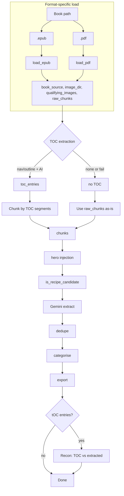
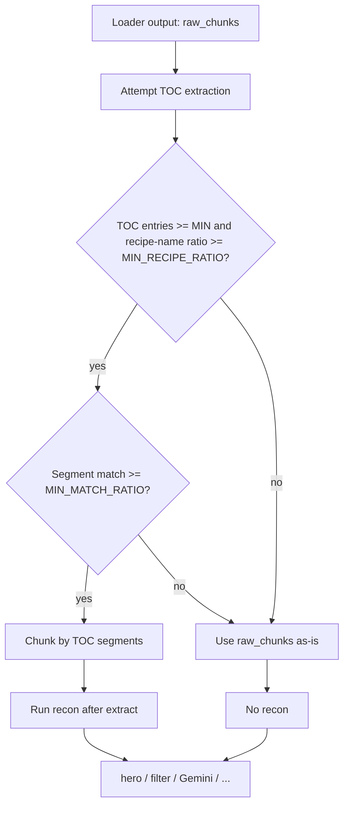
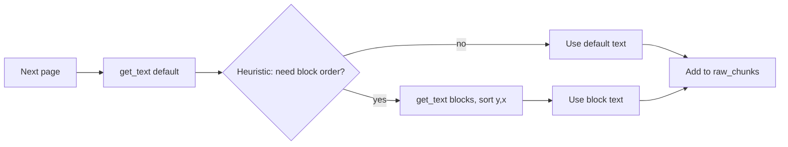

# Design: PDF support and TOC-driven chunking

This document describes the design for adding **PDF parsing** and **table-of-contents (TOC) driven chunking and reconciliation** to RecipeParser. Both EPUB and PDF use the same pipeline after a format-specific loader; TOC logic applies to both.

---

## 1. Goals

- **PDF support**: Accept PDF cookbooks alongside EPUB. Extract text and images, produce the same internal shape as EPUB so the rest of the pipeline is unchanged.
- **Single entry point**: User selects one file (EPUB or PDF); the app chooses the loader by extension. No format selector in the UI.
- **TOC as structure**: When a book has a table of contents (or outline), use it to (a) derive a recipe list, (b) drive chunk boundaries so each chunk aligns to one recipe where possible, (c) reconcile extracted recipes against the TOC to report missed or extra recipes.
- **Fallbacks**: If TOC is missing or unusable, fall back to current behaviour (EPUB: by document; PDF: by page). No FSM; linear pipeline with optional TOC step.

---

## 2. Architecture overview

### 2.1 Current pipeline (simplified)

```
[EPUB file] → read_epub → get_book_source, extract_all_images, extract_chapters_with_image_markers
    → (book_source, image_dir, qualifying_images, raw_chunks)
    → split_large_chunk → hero injection → is_recipe_candidate → Gemini extract → dedupe → categorise → export
```

Only the first line is EPUB-specific. The rest consumes a single data shape.

### 2.2 Target pipeline

```
[Book path: .epub or .pdf]
    → resolve extension → load_epub(path, output_dir)  OR  load_pdf(path, output_dir)
    → (book_source, image_dir, qualifying_images, raw_chunks)   [unchanged contract]

    → [Optional] TOC extraction (EPUB nav/outline or PDF outline + first pages)
        → AI: "Parse this TOC into recipe titles (and page/section if present)"
        → toc_entries: list[(title, page_or_section?)]

    → Chunking:
        IF toc_entries:
            segment full text by TOC (find start of each title in order) → one segment per recipe
            each segment may still be split by split_large_chunk if over max size
        ELSE:
            use raw_chunks as-is (EPUB: one per document; PDF: one per page or block-ordered page)

    → hero injection → is_recipe_candidate → Gemini extract → dedupe → categorise → export

    → [Optional] Recon: if toc_entries, compare TOC titles vs extracted recipe names
        → log/report: "TOC: 45 recipes; extracted: 42; missing: [A, B, C]"
```

So we add two optional layers: **TOC extraction** (before chunking) and **recon** (after extraction). Chunking either uses TOC boundaries or falls back to the loader’s raw chunks.

### 2.3 Data flow diagram



---

## 3. Book-loader abstraction

### 3.1 Contract

Every loader has the same signature and return type:

- **Input**: `(path: str, output_dir: str)`
- **Output**: `tuple[str, str, set[str], list[str]]`
  - `book_source`: e.g. "Title — Author" for export metadata
  - `image_dir`: absolute or relative path to the directory where images were written
  - `qualifying_images`: set of image filenames (basenames) that meet size/quality bar and should have `[IMAGE: filename]` markers
  - `raw_chunks`: ordered list of text strings (with optional `[IMAGE: ...]` markers inside). These are the units we might split further or merge based on TOC.

Pipeline chooses loader by extension (`.epub` → `load_epub`, `.pdf` → `load_pdf`). No FSM; a single dispatch at the top.

### 3.2 EPUB loader

- Refactor current code in `recipeparser/epub.py` into one function:
  - `load_epub(epub_path: str, output_dir: str) -> tuple[str, str, set[str], list[str]]`
- Implementation: `read_epub` → `get_book_source` → `extract_all_images` → `extract_chapters_with_image_markers` → return the four values. No change to behaviour.

### 3.3 PDF loader

- **Module**: `recipeparser/pdf.py`
- **Dependency**: PyMuPDF (`pymupdf`).
- **`load_pdf(path, output_dir)`**:
  - Open PDF; read metadata (title/author) for `book_source`; fallback to filename or "PDF Auto-Import".
  - Extract images: iterate pages, get images via PyMuPDF, write to `output_dir/images/` with stable names (e.g. `page{N}_img{M}.png`). Filter by `MIN_PHOTO_BYTES`; build `qualifying_images` set.
  - Build `raw_chunks`: one entry per page (or merge very small pages). For each page, get text (see §4); prepend or append `[IMAGE: filename]` for each qualifying image on that page. Optionally use block-based extraction and sort by (y, x) if default text order is bad (see §4).
- **Exception**: `PdfExtractionError` (or shared `BookExtractionError`) on open/parse failure.

### 3.4 PDF pre-flight assessment

Before running the full PDF loader, run a **pre-flight pass** to decide whether the PDF is a reasonable candidate for parsing. This avoids wasting API calls and user time on PDFs that are scans, non-cookbooks, or otherwise unlikely to yield good results. Pre-flight runs once per PDF, immediately after the user selects the file (or at the start of `load_pdf`); on failure or “poor candidate”, we can abort with a clear message or warn and continue.

#### 3.4.1 Criteria

| Criterion | Purpose | Suggested approach |
|-----------|---------|--------------------|
| **Has extractable text** | Reject image-only/scanned PDFs (no text layer). | **Programmatic**: PyMuPDF — count text blocks or total character count across first N pages (e.g. 5). If below threshold (e.g. &lt; 100 chars per page on average), treat as no text layer. |
| **Page count in range** | Reject empty or suspiciously tiny files; optionally cap very large files. | **Programmatic**: `doc.page_count`. Reject if 0; warn if &lt; 3 (might be a pamphlet); optional hard cap (e.g. 2000) to avoid runaway cost. |
| **Not password-protected** | Cannot parse locked PDFs. | **Programmatic**: PyMuPDF — try to access first page or metadata; if access denied, fail fast with “PDF is password-protected”. |
| **Language / script** | Optional: prefer supporting primary language (e.g. English) so prompts and heuristics align. | **Hybrid**: Programmatic — sample first page text, run a simple script-detection or language-guess (e.g. character set). If clearly non-Latin and we don’t support it, warn or abort. Optional AI: “What language is this text?” for borderline. |
| **Likely a cookbook / recipe content** | Reduce false positives (e.g. novels, manuals). | **Hybrid**: Programmatic — run existing `is_recipe_candidate()` on first 2–3 pages’ text; if no page passes, flag. Then **AI**: “Based on this sample (first 1–2 pages), is this document a cookbook or recipe collection? Answer yes/no and brief reason.” Only run AI when programmatic is ambiguous (e.g. one page passes, or metadata says “cookbook”). |

#### 3.4.2 Decision outcome

- **Pass**: Proceed to `load_pdf` and the rest of the pipeline.
- **Hard fail**: e.g. no text layer, password-protected, 0 pages. Abort with a specific error (no API calls).
- **Warn and continue**: e.g. “PDF may not be a cookbook” or “very few pages” — log warning and proceed so the user can still try.
- **Soft fail (configurable)**: e.g. “AI says not a cookbook” — abort unless user has opted in (e.g. “Parse anyway” in GUI or `--force` in CLI).

#### 3.4.3 Where it runs

- **Option A**: At the very start of `load_pdf(path, output_dir)`: open doc, run programmatic checks, optionally run AI assessment on a small sample, then either return the four-tuple or raise `PdfExtractionError` / `PdfNotSuitableError` with a clear reason.
- **Option B**: Separate entry point `assess_pdf(path) -> PreFlightResult` called by the pipeline (or GUI) before calling `load_pdf`; pipeline only calls `load_pdf` if assessment passes or user overrides. Keeps pre-flight logic out of the loader and allows GUI to show “This PDF may not be suitable…” before starting.

Recommendation: **Option A** (inside `load_pdf`) for simplicity; first line of `load_pdf` opens the doc and runs programmatic checks; if “likely not cookbook” is desired, a single AI call on first 1–2 pages’ text can be the last step before proceeding to image/text extraction.

---

## 4. PDF chunking and layout

### 4.1 Default: page-based

- One chunk per page. Text from `page.get_text()`. Images on that page get `[IMAGE: filename]` in that chunk’s text. Long pages are split with existing `split_large_chunk()`.

### 4.2 Layout issues

- PDFs do not have a DOM; order of text can be wrong (columns, tables, headers/footers). Libraries do not fully “fix” layout; they expose text and sometimes positions.
- **Mitigation**: If we detect or configure “use block order”, use PyMuPDF’s block-based output (`get_text("dict")` or similar), sort blocks by (y0, x0), concatenate to form page text. Use that for building `raw_chunks` instead of raw `get_text()`. No FSM; just an alternative way to build the string per page.

### 4.3 TOC-driven chunking (see §5 and §7)

When we have TOC entries, we segment the **full** text (or the concatenation of `raw_chunks` with clear boundaries) by “start of recipe N” and “start of recipe N+1”. So chunk boundaries follow recipe boundaries instead of pages. TOC chunking applies to both EPUB and PDF.

---

## 5. Parsing strategy and fallback decisioning

This section defines **when** we take each path (TOC vs raw chunking, block-based vs default PDF text) and **on what basis** we fall back. All decisions are deterministic and threshold-based where possible; no FSM.

### 5.1 Overview

- **TOC extraction** is attempted for both EPUB and PDF. If it succeeds (see 5.2), we use **TOC-driven chunking** and later **recon**. If it fails or is rejected, we **fall back to raw chunking** (loader's `raw_chunks` as-is).
- **PDF text order**: We may use **block-based** extraction (sort by position) instead of default `get_text()` when a heuristic suggests layout problems (see 5.3).
- **Recon** runs only when we have a non-empty `toc_entries` list (see 5.4).

### 5.2 TOC extraction: attempt and fallback basis

**When we attempt TOC extraction**

- **EPUB**: Always attempt. Try nav/NCX first (programmatic); if missing or empty, take first 1–2 documents (or first N characters) and send to AI for parsing.
- **PDF**: Always attempt. Try outline/bookmarks first (`doc.get_toc()`); if missing or too shallow, extract text from first 2–4 pages and send to AI: "This is the contents; list recipe titles and page numbers."

**When we consider TOC "successful" (and keep it)**

- Programmatic TOC (nav/outline) returned at least **MIN_TOC_ENTRIES** (e.g. 2). Fewer than 2 suggests "not really a recipe-level TOC".
- AI parsing returned a list with at least **MIN_TOC_ENTRIES** and the list is not rejected by sanity checks (e.g. no duplicate titles in a row, no empty titles).
- **Recipe-name ratio**: A reasonable percentage of TOC entries should look like **recipe names** (e.g. "Chocolate Chip Cookies", "Beef Stew"), not only chapter/section headers (e.g. "Soups", "Desserts", "Introduction"). If too many entries are clearly not recipe titles, treat the TOC as unsuitable. Basis:
  - **Programmatic heuristic (optional)**: Reject if almost all entries are very short (e.g. single word or two) or match a small set of common section words (e.g. "Appetizers", "Index").
  - **AI (recommended)**: One light-weight call: "Given this list of TOC entries, how many are recipe titles (specific dish names) vs section/chapter headers? Return count or list of indices that are recipe titles." Require at least **MIN_TOC_RECIPE_RATIO** (e.g. 50%) of entries to be classified as recipe names; otherwise fall back to raw chunking.
- **Sanity check (optional)**: If we have page numbers, they should be in ascending order (or at least non-decreasing). If not, log warning but still use TOC unless we have a separate "strict mode".

**When we fall back to "no TOC" (use raw_chunks)**

- No nav/outline and AI returned empty or fewer than **MIN_TOC_ENTRIES**.
- AI call failed (timeout, parse error, or model returned invalid structure).
- **Recipe-name ratio too low**: Fewer than **MIN_TOC_RECIPE_RATIO** of TOC entries were classified as recipe names (see above); treat as section-level TOC only and fall back.
- **Segment-by-TOC step** (see 5.5) finds starts for fewer than **MIN_TOC_MATCH_RATIO** (e.g. 30%) of TOC titles in the full text — suggests TOC doesn't match the body (e.g. different edition). Fall back to raw chunking to avoid sending tiny or wrong segments.
- User/config explicitly disables TOC (e.g. "use page chunking only").

**Basis summary**

| Condition | Decision |
|-----------|----------|
| TOC entries >= MIN_TOC_ENTRIES, recipe-name ratio >= MIN_TOC_RECIPE_RATIO, and segment step finds >= MIN_TOC_MATCH_RATIO of titles | Use TOC-driven chunking; run recon later. |
| TOC empty / failed / below threshold / recipe ratio too low / match ratio too low | Fall back to raw_chunks (EPUB: by document; PDF: by page). No recon. |

### 5.3 PDF text extraction: default vs block-based

**When we use default `get_text()`**

- Default for all PDFs unless the heuristic below triggers.

**When we use block-based extraction (sort by y, then x)**

- **Heuristic**: For each of the first **N_SAMPLE_PAGES** (e.g. 5), get text with default `get_text()` and with block-based (dict/blocks, sort by (y0, x0), concatenate). Compare character count or line count. If block-based yields **meaningfully more** text (e.g. > 20% more) or **fewer** very-short lines, treat as "likely multi-column or complex layout" and use block-based for the **entire** document.
- **Alternative (simpler)**: Use block-based unconditionally for PDF (slightly slower but more predictable). Then no heuristic needed; we rely on "block order is usually better" for cookbooks.
- **Basis**: Programmatic only (no AI). Thresholds: N_SAMPLE_PAGES, percent difference in length or line count. If we adopt "always block-based for PDF", this decision goes away.

**Recommendation**: Start with **default only**; add block-based as a fallback when we detect "very little text per page" (e.g. < 200 chars on first 3 pages) to handle "text is there but in wrong order". Later, optional "always use block order for PDF" config.

### 5.4 Recon: when it runs

- Run recon **only** when `toc_entries` is non-empty and was used for chunking (i.e. we did not fall back to raw chunking for "match ratio too low"). If we fell back, we do not report "missing" against TOC because we didn't use TOC for boundaries.
- **Basis**: Presence of `toc_entries` and the chunking path we actually took (flag or same condition as in 5.2).

### 5.5 Segment-by-TOC: finding recipe starts and fallback

- **Input**: Full text (concatenated `raw_chunks` with a delimiter or index map) and `toc_entries`.
- **Algorithm**: For each TOC title in order, search for the **first occurrence** of the title (normalized: lowercase, collapse spaces) in the full text **after** the end of the previous segment. That position = start of this recipe. Segment = text from this start to the next start (or end of book). If a segment exceeds **MAX_CHUNK_CHARS**, split it with `split_large_chunk`.
- **Failure per entry**: If a title is not found, we can (a) skip that entry and continue, (b) treat the whole TOC as failed and fall back to raw chunking. Recommendation: (b) only if **fewer than MIN_TOC_MATCH_RATIO** of titles are found (e.g. 30%); otherwise (a) and log "TOC entry not found: …" for recon.
- **Basis**: Match ratio = (number of titles whose start was found) / len(toc_entries). If ratio < MIN_TOC_MATCH_RATIO, abort TOC chunking and use raw_chunks.

### 5.6 Decision flow summary



For PDF only, before building `raw_chunks`:



### 5.7 Configurable constants (suggested)

| Constant | Suggested | Purpose |
|----------|-----------|---------|
| MIN_TOC_ENTRIES | 2 | Fewer = treat as no TOC. |
| MIN_TOC_RECIPE_RATIO | 0.5 | Fraction of TOC entries that must be classified as recipe names (not section headers); below this = fall back to raw chunking. |
| MIN_TOC_MATCH_RATIO | 0.3 | Fraction of TOC titles that must be found in text to use TOC chunking. |
| N_SAMPLE_PAGES (PDF block heuristic) | 5 | Pages to sample when deciding default vs block-based. |
| PDF_PREFLIGHT_MIN_CHARS_PER_PAGE | 100 | Below this (average over first 5 pages) = no text layer / scan. |

### 5.8 FSM reconsidered

We now have several decision points: PDF pre-flight (pass / fail / warn), TOC extraction (attempt → success vs fallback), recipe-name ratio, segment-match ratio, chunking path (TOC vs raw), and whether to run recon. The question is whether to model this as an **explicit FSM** (state enum + transition table) instead of a linear sequence of conditionals.

**Conclusion: still not required, but a *stage* enum is recommended for clarity and logging.**

- **Flow remains acyclic**: We never loop back (e.g. "retry TOC" or "go back to load"). We only branch forward: try TOC → use it or fall back to raw; then extract → recon if TOC was used. There are no event-driven transitions (user pause/resume, retries). So the control flow is "structured if/else over stages," not "react to events and transition between states."
- **An FSM becomes useful when**: (1) We add **retries** (e.g. on failure transition back to Load or TOCAttempt). (2) We add **pause/resume** or user-driven transitions. (3) The number of states and transitions grows enough that a transition table is easier to maintain than nested conditionals. (4) We want **audit logging** where every transition is explicit ("entered state X because Y").
- **Recommendation**:
  - **Now**: Keep the pipeline as a **linear sequence of steps** with clear conditionals (as in §5.2–5.5). **Maintain a state enum class** that reflects all relevant state variables (stage, chunking path, recon status, pre-flight outcome); see §5.9. Set it at each step; use for logging and GUI progress. No transition table—just assign the state as we go.
  - **Later**: If we add retries, pause/resume, or many more branches, introduce a real FSM (state enum + `transition(event)` or explicit next-state table) so the allowed paths are first-class and easy to reason about.

### 5.9 State enum class (required)

Despite the pipeline being acyclic, we **explicitly maintain a state enum class** that reflects the current state variables at each step. This makes the pipeline auditable, loggable, and testable without introducing a full FSM.

**State variables to capture**

- **Stage**: Where we are in the pipeline. Enum values should align with the steps in §5.6 (e.g. `LOAD`, `PREFLIGHT`, `TOC_EXTRACT`, `CHUNK`, `EXTRACT`, `RECON`, `EXPORT`). Sub-stages are acceptable (e.g. `CHUNK_TOC` vs `CHUNK_RAW`) so logs and GUI can show "Chunking (TOC)" vs "Chunking (raw)".
- **Chunking path** (when past TOC): Whether we are using TOC-driven segments or raw chunks. Enum or flag: e.g. `TOC_DRIVEN` | `RAW_CHUNKS`.
- **Recon**: Whether recon will run / has run. Enum or flag: e.g. `RECON_PENDING`, `RECON_DONE`, `RECON_SKIPPED` (no TOC used).
- **Pre-flight outcome** (PDF only): e.g. `PREFLIGHT_PASS`, `PREFLIGHT_FAIL`, `PREFLIGHT_WARN`.

**Form**

- A single **state enum class** (or small set of enums) in one place (e.g. `recipeparser/pipeline.py` or `recipeparser/state.py`) that defines these values. The pipeline (and any GUI/CLI that reports progress) **updates this state** at each relevant step—e.g. set `stage = Stage.CHUNK`, `chunking_path = ChunkingPath.TOC_DRIVEN`—so that at any moment the state enum class reflects the current state variables.
- **No transition table**: we do not enforce "only X can follow Y"; we only **set** the state as we go. The enum class is the single source of truth for "what state are we in?" for logging, progress, and debugging.

**Usage**

- Logging: log the current stage (and path/recon when relevant) at step boundaries.
- GUI: progress label or status text derived from the state enum (e.g. "TOC extraction", "Chunking (TOC)", "Recon…").
- Tests: assert on state after a step (e.g. after TOC fallback, `chunking_path == ChunkingPath.RAW_CHUNKS`).

**Example (conceptual)**

```text
class Stage(Enum): LOAD; PREFLIGHT; TOC_EXTRACT; CHUNK_TOC; CHUNK_RAW; EXTRACT; RECON; EXPORT
class ChunkingPath(Enum): TOC_DRIVEN; RAW_CHUNKS
class ReconStatus(Enum): SKIPPED; PENDING; DONE
# Pipeline holds current_stage, chunking_path (when applicable), recon_status; set at each step.
```

---

## 6. GUI and CLI

- **GUI**: One file input; label e.g. “Cookbook file (EPUB or PDF)”. File dialog: `*.epub;*.pdf`. User picks a file; backend resolves path and chooses loader by extension. No separate “format” control.
- **CLI**: Single positional argument: path to an EPUB or PDF file, or a directory containing exactly one `.epub` or exactly one `.pdf`. Resolve logic extended so that if it’s a directory, look for one `.epub` or one `.pdf` (if both exist, error “specify one file”).
- **API**: `process_epub(book_path, ...)` name can stay for backward compatibility; docstring states it accepts EPUB or PDF.

---

## 7. TOC extraction and use

### 7.1 Purpose

- Get a **recipe list** from the book (TOC or outline).
- Use it to **drive chunk boundaries** (one segment per recipe when possible).
- **Reconcile** extracted recipes vs TOC to report missed (and optionally extra) recipes.

### 7.2 Obtaining TOC data

- **EPUB**:
  - Prefer machine-readable **nav/NCX**: parse and get (title, link/section). If that’s sufficient, we may not need AI for structure.
  - If nav is missing or not recipe-level, send **first document(s)** or first N characters to the model with a prompt: “This is the table of contents. Extract the list of recipe titles and, if present, section or document identifiers.”
- **PDF**:
  - Use **outline/bookmarks** (`doc.get_toc()` in PyMuPDF); often includes page numbers.
  - If outline is missing or unhelpful, send **first few pages** to the model: “This is the contents page. List recipe titles and page numbers.”
- **AI**: One Gemini call to normalize and parse: “Given this TOC/outline, return a list of recipe titles and, when available, page numbers or section identifiers.” Output: `list[(title, page_or_section | None)]`. This keeps “spotting” the TOC simple (structure first, AI to parse when needed). Then validate that at least **MIN_TOC_RECIPE_RATIO** of entries look like recipe names (not just section headers), via a second AI call or the same response; if below threshold, do not use TOC (see §5.2).

**Recipe-only filter (implemented)**  
We **always** run one AI classification call on the raw TOC (programmatic nav/outline or AI-parsed fallback) to identify which entries are recipe titles vs section/front matter (e.g. Cover, Introduction, "How to Make Dough"). The pipeline uses only the **filtered** list (recipe entries only) for recon—and for any TOC-driven chunking when enabled. So recon counts and "missing" lists refer to recipes only, not supporting material. On classification failure we keep the full list so recon still runs.

### 7.3 Chunk separation using TOC

- **Input**: Full ordered text (or `raw_chunks` with a way to map back to positions) and `toc_entries`.
- **Algorithm**: For each TOC entry in order, find the “start” of that recipe in the text (e.g. first occurrence of the title, or start of page N). Segment text from “start of entry i” to “start of entry i+1” (or end of book). Each segment is one recipe’s text; if over `MAX_CHUNK_CHARS`, split with `split_large_chunk`.
- **Fallback**: If TOC extraction fails or returns empty, do not use TOC; use loader’s `raw_chunks` as today (EPUB by document, PDF by page).

### 7.4 Recon

- After extraction we have: `toc_entries` (expected) and `extracted_recipe_names` (from Gemini). The `toc_entries` used here are **recipe-only**: the pipeline runs one AI classification on the raw TOC to drop section headers and front matter (see §7.2), so recon counts and "missing" lists refer only to recipe titles.
- **Matching**: Normalize titles (lowercase, strip punctuation) and match TOC titles to extracted names (exact or fuzzy). Build:
  - `matched`: in both
  - `missing`: in TOC but not in extracted
  - `extra`: extracted but not in TOC (optional to report)
- **Output**: Log and/or GUI: “TOC: 45 recipes; extracted: 42; missing: [Recipe A, Recipe B, Recipe C].” No FSM; a single post-extraction step when `toc_entries` is present.

---

## 8. Implementation phases

| Phase | Content |
|-------|--------|
| **Phase 1** | Loader abstraction; refactor EPUB into `load_epub`; add `load_pdf` with **PDF pre-flight assessment** (§3.4); page-based chunks and images. CLI/GUI accept .epub and .pdf. Pipeline dispatches by extension. |
| **Phase 2** | TOC extraction: EPUB nav/outline + PDF outline + optional AI parse → `toc_entries`. Chunking: when `toc_entries` present, segment by TOC; else keep current behaviour. Recon: compare TOC vs extracted; log/report missing (and optionally extra). |
| **Phase 2b** | If needed: block-based PDF text extraction (sort by position) for messy layouts. |

---

## 9. Files to add or change

- **recipeparser/epub.py**: Add `load_epub(path, output_dir)` returning the four-tuple; keep existing helpers.
- **recipeparser/pdf.py**: New; `load_pdf(path, output_dir)` with **pre-flight assessment** (§3.4) at entry; optional helper for block-ordered text.
- **recipeparser/pipeline.py**: Dispatch by extension to loader; accept optional TOC step and TOC-driven chunking; add recon step when TOC present. **Maintain a state enum class** (§5.9) and set current stage, chunking path, recon status (and pre-flight outcome for PDF) at each step. Parameter can remain `epub_path` or be renamed `book_path`.
- **recipeparser/exceptions.py**: Add `PdfExtractionError` or `BookExtractionError`.
- **recipeparser/__main__.py**: Resolve .epub or .pdf; update help text.
- **recipeparser/gui.py**: Single file picker for EPUB/PDF; label and filetypes updated.
- **recipeparser/__init__.py**: Docstring for `process_epub` (accepts EPUB or PDF).
- **New (Phase 2)**: TOC extraction module (e.g. `recipeparser/toc.py`): EPUB nav parsing, PDF outline, one AI call to parse TOC into `list[(title, page_or_section?)]`; function to segment text by TOC entries (see §5.5); recon comparison and report.
- **requirements.txt**: Add `pymupdf`.
- **Tests**: Loader tests for PDF; CLI/GUI tests for .pdf; TOC and recon tests when Phase 2 is implemented.
- **README**: Document support for PDF and optional TOC/recon behaviour.

---

## 10. Out of scope / future

- **FSM controller**: Re-evaluated in §5.8. Not required for current acyclic, conditional flow; a **stage enum** for logging/progress is recommended. Adopt a full FSM if we add retries, pause/resume, or event-driven transitions.
- Pause/resume or retry states: could be designed later and might then benefit from a state machine.
- Semantic “recipe” detection in PDF (e.g. heading detection) for chunking when TOC is absent: possible follow-up.

- Semantic "recipe" detection in PDF (e.g. heading detection) for chunking when TOC is absent: possible follow-up.

---

## 11. Build readiness and best practice

### 11.1 Is there enough to proceed?

**Yes.** The design is sufficient to start implementation. A developer can:

- Implement loaders from the **contract** (§3.1) and **loader specs** (§3.2, §3.3, §3.4).
- Implement **TOC extraction and segment-by-TOC** from §5.2, §5.5, §7.
- Implement **pipeline orchestration** from §2.2, §5.6, and the **state enum** (§5.9).
- Implement **pre-flight** from §3.4 (criteria, outcomes, Option A).
- Add **CLI/GUI** changes from §6 and §9.
- Place **constants** in a single place (e.g. `recipeparser/config.py`) and **exceptions** in `exceptions.py` (§9).

**Small gaps to resolve during implementation (no design change needed)**

- **Config location**: Define MIN_TOC_ENTRIES, MIN_TOC_RECIPE_RATIO, MIN_TOC_MATCH_RATIO, N_SAMPLE_PAGES, PDF_PREFLIGHT_MIN_CHARS_PER_PAGE in `config.py` (or equivalent) so they are tunable in one place.
- **TOC entry type**: `page_or_section` — use `int | None` for PDF page numbers, `str | None` for EPUB nav targets (or a small union type). Document in `toc.py`.
- **Pre-flight exception**: Decide whether to use one exception (`PdfExtractionError` with a reason/code) or two (`PdfExtractionError` for open/parse, `PdfNotSuitableError` for pre-flight reject). Design supports either.
- **User-facing copy**: Define exact error and warning messages for CLI/GUI (e.g. "PDF has no text layer", "TOC not used (section headers only)", "PDF may not be a cookbook — use --force to continue") when implementing.

### 11.2 Best practice checklist

| Criterion | Met? | Notes |
|-----------|------|--------|
| **Clear goals and scope** | Yes | §1 Goals; §10 Out of scope. |
| **Contract-first interfaces** | Yes | Loader contract (§3.1); state enum (§5.9); pipeline input/output. |
| **Single responsibility** | Yes | Loaders = load; toc.py = TOC parse + segment + recon; pipeline = orchestrate. |
| **Explicit fallbacks** | Yes | §5.2–5.5: when and why we fall back; thresholds in §5.7. |
| **Observability** | Yes | State enum for stage, path, recon, pre-flight; logging and GUI progress. |
| **Testability** | Yes | State assertions (§5.9); loader contract testable in isolation; TOC/recon unit tests. |
| **Configurable behaviour** | Yes | Constants table (§5.7); config location to be set in code. |
| **Error handling** | Yes | Pre-flight outcomes (§3.4.2); exceptions named (§3.3, §9); hard fail vs warn vs soft fail. |
| **Backward compatibility** | Yes | process_epub name and EPUB behaviour preserved; PDF additive. |
| **Phased delivery** | Yes | Phase 1 (PDF + pre-flight), Phase 2 (TOC + recon), Phase 2b (block-based) in §8. |
| **Documentation** | Yes | Design doc; README update in §9; docstrings for API. |

**Recommendation**: Proceed with the build. Resolve the small gaps above in code and config; no further design doc change required for a first implementation pass.

---

## 12. Summary

- **PDF**: Second loader, same contract as EPUB; page-based chunks (and optionally block-ordered text); images extracted and marked per page.
- **GUI/CLI**: Single file type (EPUB or PDF); backend chooses loader by extension.
- **TOC**: Extract recipe list from structure (nav/outline) + one AI parse; use for chunk boundaries and for recon. Same logic for EPUB and PDF; fallback to current chunking when TOC is missing or fails.
- **Recon**: When TOC is present, compare TOC vs extracted recipe names and report: TOC count, extracted count, matched, missing (in TOC but not extracted), and extra (extracted but not in TOC). The TOC used for recon is **recipe-only**: we always run one AI classification on the raw TOC so section headers and front matter (Cover, Introduction, etc.) are excluded; recon counts and “missing” lists refer only to recipe titles. Runs when `toc_entries` is non-empty (§5.4).
- **PDF pre-flight**: Assess PDF before full load (§3.4); programmatic checks (text layer, page count, password); optional AI/hybrid for “likely cookbook”.
- **No FSM**; clear linear pipeline with optional TOC and recon steps. **State enum class** (§5.9) is required: stage, chunking path, recon status (and pre-flight outcome for PDF) are maintained and set at each step for logging, GUI, and tests.
